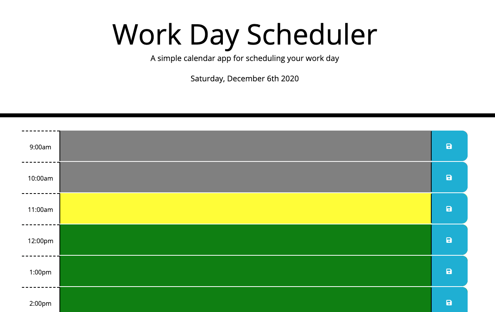

# Work Day Scheduler

## Description 

This repository contains a simple calendar application that allows a user to save events for each hour of the day. The app will run in the browser and feature dynamically updated HTML and CSS powered by jQuery and moment.js date/time library.

The user will simply need to enter events in the time bar as desired, click the save icon, and their events will be saved, even after screen is refreshed. Color coding of past, present, and future hours are also included.

Website URL: https://anniemcfarland7.github.io/Work-Day-Scheduler/

Repository URL: https://github.com/anniemcfarland7/Work-Day-Scheduler

## Screenshot 

The following image shows the web application's initial appearance:

